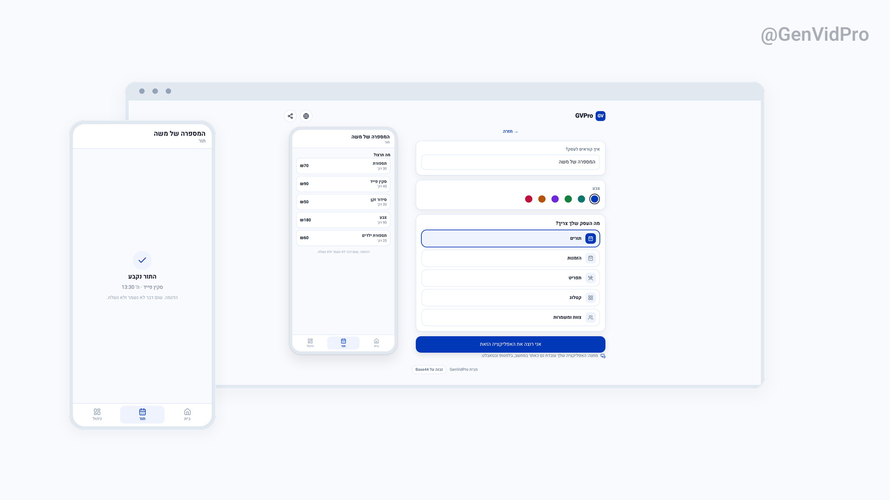
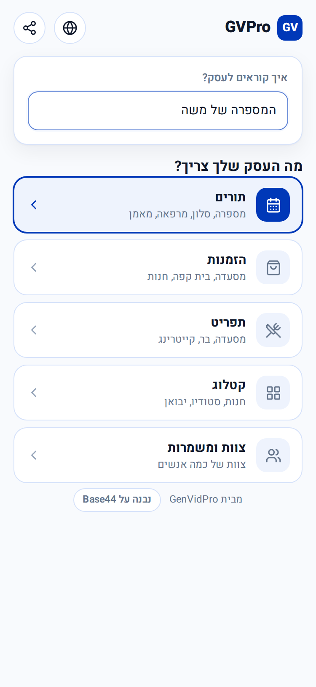
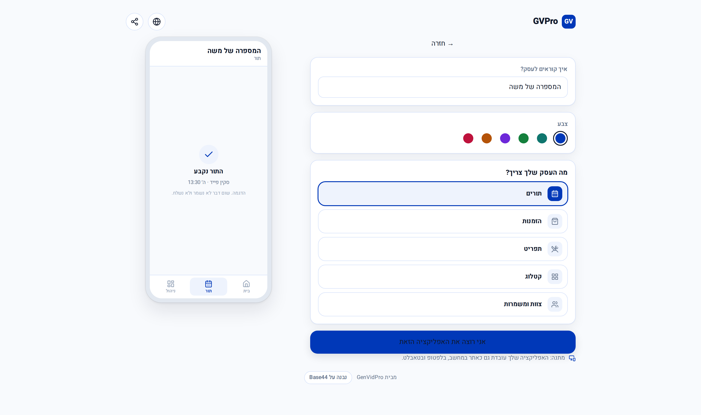
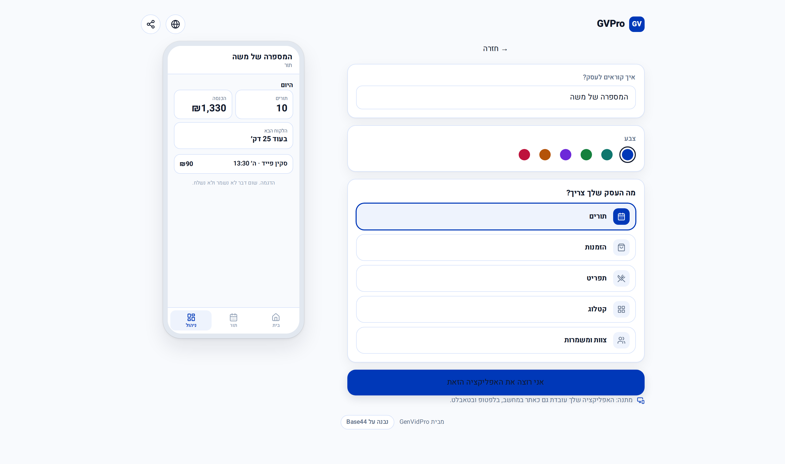
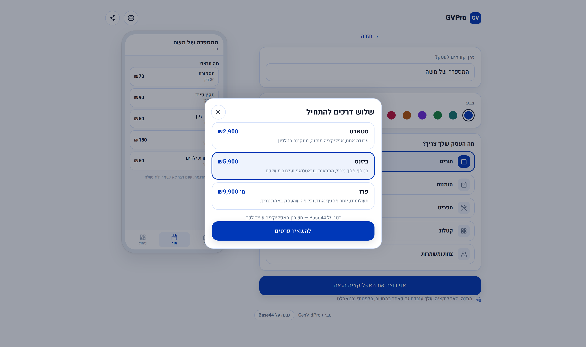

# GVPro

Type your business name, try its working app on the phone in front of you, order it.

**Live: [gvpro.base44.app](https://gvpro.base44.app)**

<a href="https://github.com/romachorny/gvpro-base44/releases/download/gvpro-film/gvpro-he-16x9-r2.mp4"></a>

The film is 33 seconds. Hebrew [wide](https://github.com/romachorny/gvpro-base44/releases/download/gvpro-film/gvpro-he-16x9-r2.mp4) and [vertical](https://github.com/romachorny/gvpro-base44/releases/download/gvpro-film/gvpro-he-9x16-r2.mp4), English [wide](https://github.com/romachorny/gvpro-base44/releases/download/gvpro-film/gvpro-en-16x9-r2.mp4) and [vertical](https://github.com/romachorny/gvpro-base44/releases/download/gvpro-film/gvpro-en-9x16-r2.mp4). All four files and their posters are in the [gvpro-film release](https://github.com/romachorny/gvpro-base44/releases/tag/gvpro-film).

## Two screens

The first screen asks one question. Bookings, orders, a menu, a catalogue, or a team on a rota.

The second screen hands back the app. A phone with a working demo of exactly that job, and next to it the owner's own screen: today's count, the revenue, the next customer. A customer app is easy to picture. Opening your own phone at eight in the morning is not.

Then one blue button: I want this app. The same app also works as a website on a computer, laptop and tablet. There is no site to choose.

Hebrew is the default and right to left is first class. English, Russian and Arabic are there too.

The demo saves nothing. Slots really fill, the basket really adds up, the shift board really hands you a shift, and all of it dies with the tab. Every screen of the demo says so.

## The app

<table>
<tr>
<td width="25%" valign="top" align="center">
<br>
Name the business, pick the job
</td>
<td width="75%" valign="top" align="center">
<br>
The booking demo, running
</td>
</tr>
<tr>
<td colspan="2" valign="top" align="center">
<br>
The owner tab: today's count, the revenue, the next customer
</td>
</tr>
<tr>
<td colspan="2" valign="top" align="center">
<br>
Three ways to start
</td>
</tr>
</table>

These are real captures, taken by the walk in `tests/check.mjs` and kept in `tests/shots/`.

## Packages

| | | |
| --- | --- | --- |
| **Start** | ₪2,900 | One job, a finished app, installs on the phone. |
| **Business** | ₪5,900 | Plus the owner screen, WhatsApp notices and your own look. |
| **Pro** | from ₪9,900 | Payments, more than one branch, and whatever else the business really needs. |

The Base44 account stays yours.

## Built on Base44 by GenVidPro

GenVidPro is a one person studio in Petah Tikva that builds small business apps on [Base44](https://base44.com) and ships them in Hebrew, English, Russian and Arabic.

More apps and what they cost: [genvidpro.com/apps](https://genvidpro.com/apps)

## What is in this repo

This repo is a delivery, not a deployment. Every path here is the path the file has to take inside the Base44 app. [MANIFEST.md](MANIFEST.md) says which files to write, which scaffold files to change, what permissions the `Lead` entity needs, and what is deliberately left out.

`app.genvidpro.com` and `genvidpro.com` stay exactly as they are, on Cloudflare. Nothing here touches them.

Every file of the delivery is text. No fonts, no photographs, no icons on disk. Heebo arrives from Google Fonts by a `<link>`, the icons come from `lucide-react` which the Base44 scaffold already depends on, and the demo draws its own furniture in CSS. The whole app can be written in through the platform API.

```
npm install
npm run build
npm run preview          # http://127.0.0.1:4173
node tests/check.mjs     # the walk: 1521 px and 375 px, in Hebrew and English
```

The build runs against the stock Base44 scaffold with no extra dependency. Without `VITE_BASE44_APP_ID` the SDK has no backend, which is fine for the build and for the walk. `tests/check.mjs` answers every API call locally, so it never writes a Lead anywhere.

The screenshots the walk leaves in `tests/shots/` are meant to be looked at. A green run on its own proves nothing. In v1 it caught a layout that had walked off the right edge while `scrollWidth` said it was fine, a chip a locator called visible under the iframe covering it, and a Hebrew app with an English price list that passed the script check aimed at the wrong element.

The template engine, the sixty templates, the seventy fonts and the hundred and forty photographs of v1 are gone from the working tree and still in this repo's history, at commit `46ad186` and its parents. GVPro used to pick a look. genvidpro.com already does that. This one hands over a working app.
